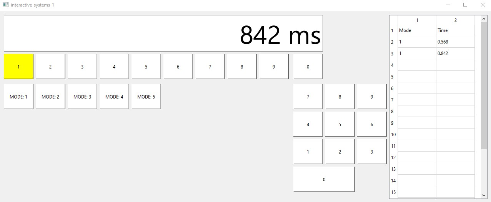

# Программа для измерения реакции пользователя на события от клавиатуры
Стандартное окно, содержащее текстовую область для вывода результатов, измерений, часть стандартной клавиатуры, кнопки для режимов работы и таблицу, в которой хранятся результаты работы программы.

Режимы:
- Цвет меняет первая клавиша верхней цифровой клавиатуры
- Цвет меняет произвольная клавиша верхней цифровой клавиатуры
- Цвет меняет первая клавиша боковой цифровой клавиатуры клавиатуры
- Цвет меняет прозвольная клавиша боковой цифровой клавиатуры
- Цвет меняет произвольная клавиша верхней или боковой цифровых клавиатур

Главное окно

